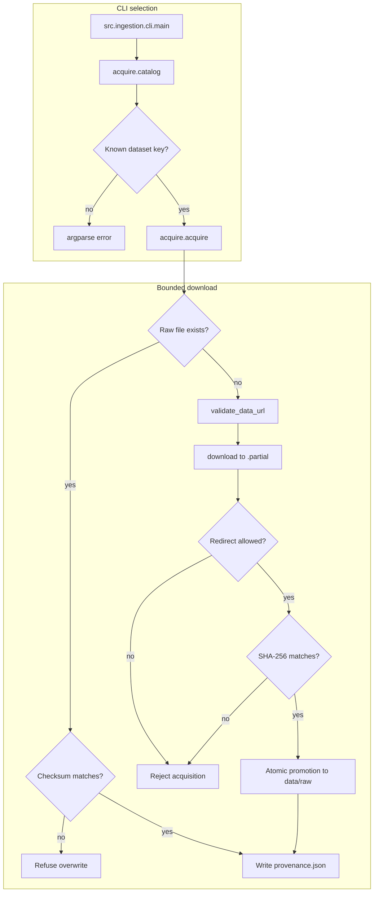
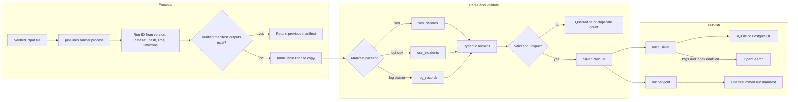
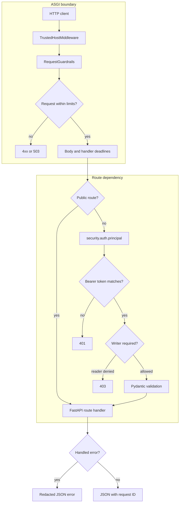
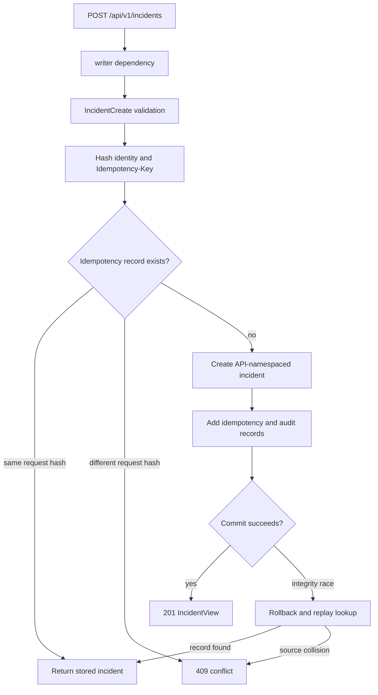
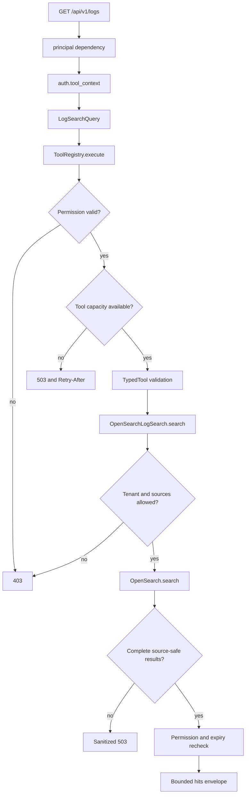

# Enterprise Agentic AI Operations

This repository implements a provenance-preserving incident data foundation. It acquires public incident and infrastructure-log datasets, produces Bronze, Silver, and Gold data, loads operational records into SQL, and exposes authenticated incident and log-search APIs. Typed contracts define later investigation, retrieval, model, and approval boundaries without implementing those runtimes.

**Status: In development.** The data foundation and Phase B read-only tool boundary are complete. Agent execution, RAG, MCP, enterprise identity, approval execution, and the dashboard are not built.

---

## Repository structure

```text
.
├── apps/
│   ├── api/main.py                         # FastAPI app, middleware, routes, lifespan
│   └── dashboard/README.md                 # Dashboard placeholder
├── data/
│   ├── dataset_manifest.json               # URLs, checksums, schemas, licenses, limits
│   ├── raw/                                # Ignored acquired source files
│   ├── bronze/                             # Ignored immutable source copies
│   ├── silver/                             # Ignored validated Parquet records
│   └── gold/                               # Ignored analytical Parquet outputs
├── docs/
│   ├── flows/                              # Detailed implemented flow references
│   ├── datasets.md                         # Dataset inventory and provenance
│   ├── guardrails.md                       # Implemented and planned controls
│   ├── phase-b.md                          # Typed tool-boundary scope
│   └── target-architecture.md              # Phase A-M target, marked by status
├── infrastructure/
│   ├── Dockerfile                          # Python 3.11 API image
│   ├── analytics.sql                       # PostgreSQL analytical views
│   └── migrations/                         # Alembic environment and revision 0001
├── scripts/
│   ├── init_local.py                       # Create ignored local credentials
│   ├── run_integration.py                  # PostgreSQL and OpenSearch tests
│   ├── smoke_api.py                        # Real Uvicorn HTTP smoke test
│   └── check_repository.py                 # Narrow tracked-file exposure check
├── src/
│   ├── domain/contracts.py                 # Frozen Phase B domain and tool contracts
│   ├── ingestion/                          # CLI and bounded acquisition
│   ├── integrations/                       # OpenSearch client and typed adapter
│   ├── models/                             # Pydantic records and SQLAlchemy schema
│   ├── pipelines/                          # Parsers, normalization, products, loading
│   ├── security/                           # Auth, policy, egress, ASGI guardrails
│   ├── services/                           # Settings, ports, tools, database helpers
│   ├── observability/logging.py             # JSON log formatter
│   ├── agents/README.md                     # Agent runtime placeholder
│   ├── mcp/README.md                        # MCP placeholder
│   ├── orchestration/README.md              # Orchestration placeholder
│   └── rag/README.md                        # RAG placeholder
├── tests/                                   # Unit, API, security, integration tests
├── .github/workflows/ci.yml                 # Quality and real-backend CI jobs
├── docker-compose.yml                       # Local services and future profiles
├── pyproject.toml                           # Package, CLI, tools, dependencies
├── uv.lock                                  # Locked Python environment
└── alembic.ini                              # Migration configuration
```

The placeholder directories contain no runtime implementation. See the [full tracked tree](docs/repository-map.md).

---

## Dataset acquisition flow



The manifest controls source URLs, expected size, checksum, parser, and license metadata. A partial or changed file is never promoted as a successful acquisition.

**Network policy**: Downloads require HTTPS and an exact host allowlist. Redirects are revalidated, limited to six requests, and cannot add credentials, fragments, or nonstandard ports.

**Bounds**: Transport failures retry three times. Transfers reject content encoding, excess bytes, checksum mismatch, and a download duration above 120 seconds.

**Concurrency**: A per-dataset file lock serializes acquisition. Existing raw bytes are reused only after checksum verification.

**Status**: Complete for the seven entries in `data/dataset_manifest.json`. Large Loghub archives are listed but not automatically downloaded or extracted.

See [Dataset and pipeline flow](docs/flows/data-pipeline.md).

---

## Bronze, Silver, Gold, and load flow



The pipeline preserves original bytes and assigns deterministic run and record identities. Database and search writes are replayable, but they are not one distributed transaction.

**Trace integrity**: A BPI 2013 limit counts complete XES traces. It does not truncate an incident timeline.

**Time handling**: Offset-aware timestamps normalize to UTC. Naive timestamps remain unset unless the operator supplies `--timezone`. Ambiguous or nonexistent local times are rejected.

**Quarantine**: Invalid source rows retain a reason and source context. BPI 2014 rows without incident IDs are quarantined; IDs are not fabricated.

**Replay**: SQL uses source-scoped conflict handling. OpenSearch hashes `source` and `source_id` for document IDs. Re-running the same input repairs interrupted indexing.

**Status**: Complete for local files, SQLite/PostgreSQL loading, and OpenSearch log indexing. Scheduling and live enterprise extraction are planned.

See [Dataset and pipeline flow](docs/flows/data-pipeline.md).

---

## HTTP request and authentication flow



The ASGI boundary rejects oversized or slow requests before route logic. Authentication uses local static reader and writer keys; it is not enterprise identity.

**Request limits**: Headers are limited to 16 KiB, query strings to 4096 bytes, and bodies to `MAX_REQUEST_BYTES`. Mutating requests require JSON. Compressed bodies are rejected.

**Capacity**: `/health` bypasses the local fixed-window rate limit. Other requests share an in-process client map and concurrency counter. These controls are not distributed across replicas.

**Errors**: Validation responses omit submitted values. Database and search failures return sanitized 503 responses. Security headers disable caching, framing, MIME sniffing, and referrers.

**Production gate**: `Settings` rejects `ENVIRONMENT=production`. Entra/OIDC and deployment review are required before that gate can change.

**Status**: Complete for the local API boundary. Enterprise authentication, tenancy, TLS termination, and distributed rate limiting are planned.

See [HTTP API flow](docs/flows/http-api.md).

---

## Incident creation flow



Incident creation commits the incident, idempotency record, and audit event in one SQL transaction. Client input cannot select a benchmark source namespace.

**Validation**: Unknown fields fail. `opened_at` must contain a timezone and is normalized to UTC. The idempotency header length is 1 to 128 characters.

**Collision rules**: Reusing a key with changed content returns 409. A different key cannot bypass the unique `(source, source_id)` constraint.

**Status**: Complete for manual incident create, list, and get. Investigation and approval routes do not exist.

See [HTTP API flow](docs/flows/http-api.md).

---

## Authorized log-search flow



The route passes through a sealed, read-only registry that validates input, output, permission, timeout, concurrency, and output size.

**Scope**: The server creates the authorization context. Client tenant or permission headers are ignored. Only the five configured Loghub sources are available through the API.

**Backend behavior**: Search retries 429 and server failures three times. Three exhausted operations open the client circuit for 30 seconds. Partial shard results, timeouts, malformed records, and records outside the allowlist fail closed.

**Tool limits**: The registry allows eight concurrent executions by default, a 10-second timeout, and 256 KiB serialized output. The API query limit is 1 to 100 results.

**Status**: Complete for keyword log search. Dense retrieval, hybrid fusion, reranking, Qdrant, and pgvector are planned.

See [Authorized log-search flow](docs/flows/log-search.md).

---

## Container and CI flow

```mermaid
flowchart TD
    Push["Push or pull request"] --> Quality["Quality job"]
    Push --> Backends["Backends job"]
    subgraph "Quality"
        Quality --> Sync["uv sync frozen"]
        Sync --> Static["Exposure, Ruff, MyPy"]
        Static --> Unit["Non-integration pytest"]
        Unit --> Schema["Alembic upgrade and check"]
    end
    subgraph "Real backends"
        Backends --> Secrets["scripts/init_local.py"]
        Secrets --> Services["PostgreSQL and OpenSearch"]
        Services --> Integration["scripts/run_integration.py"]
        Integration --> Image["Build API image"]
        Image --> API["API readiness smoke"]
        API --> Down["docker compose down"]
    end
```

CI separates deterministic checks from tests that require real PostgreSQL and OpenSearch. The API container starts after migration completion and backend health checks.

**Compose exposure**: Published ports bind to loopback. OpenSearch security is disabled for this local stack.

**Future profiles**: Redis and Qdrant use the `future` profile. No application module connects to either service.

**Schema gate**: CI applies revision `0001_foundation` and runs `alembic check`. Readiness also requires that revision.

**Status**: Complete for local/CI containers. Kubernetes, AKS, Azure resources, and deployment workflows are planned.

See [Runtime and CI flow](docs/flows/runtime-ci.md).

---

## Build requirements

- Python 3.11 through 3.14. CI and the image use Python 3.11.
- `uv` 0.12.15. CI and the Dockerfile pin this version.
- Git.
- Docker with Compose for PostgreSQL/OpenSearch integration tests.
- At least 4 GiB available to Docker is a practical OpenSearch local setting.

Windows PowerShell:

```powershell
py -3.11 -m pip install uv==0.12.15
uv sync --frozen --python 3.11
```

Linux or macOS:

```sh
python3.11 -m pip install uv==0.12.15
uv sync --frozen --python 3.11
```

Linux may require the setting used by CI:

```sh
sudo sysctl -w vm.max_map_count=262144
```

Configuration comes from `.env` through `Settings`:

| Variable | Default or source | Rule |
| --- | --- | --- |
| `DATABASE_URL` | Local SQLite | Compose uses PostgreSQL with `asyncpg` |
| `OPENSEARCH_URL` | `http://localhost:9200` | `.env.example` uses port `19200` |
| `OPENSEARCH_USERNAME`, `OPENSEARCH_PASSWORD` | Unset | Optional HTTP basic authentication |
| `OPENSEARCH_REQUIRED` | `false` | Adds OpenSearch to readiness when true |
| `API_READ_KEY`, `API_WRITE_KEY` | Unset | Must differ when both are set |
| `ENVIRONMENT` | `local` | `production` is rejected |
| `ALLOWED_HOSTS` | Localhost addresses | Empty and wildcard lists are rejected |
| `MAX_REQUEST_BYTES` | `65536` | Range 1024 to 1048576 |
| `REQUESTS_PER_MINUTE` | `120` | In-process fixed-window limit |
| `MAX_CONCURRENT_REQUESTS` | `32` | In-process request limit |
| `BODY_TIMEOUT_SECONDS` | `5` | Range above 0 through 60 |
| `HANDLER_TIMEOUT_SECONDS` | `30` | Range above 0 through 300 |

---

## Building and running

```sh
uv sync --frozen --python 3.11
uv run python scripts/init_local.py
uv run alembic upgrade head
uv run ops-data all --limit 100 --load
uv run uvicorn apps.api.main:app --host 127.0.0.1 --port 8000 --no-access-log --no-proxy-headers
```

`scripts/init_local.py` fails rather than overwrite an existing `.env`.

Container runtime:

```sh
docker compose up -d --build --wait
uv run python scripts/run_integration.py
```

The API listens on `127.0.0.1:8000`, PostgreSQL on `127.0.0.1:55432`, and OpenSearch on `127.0.0.1:19200`.

---

## Commands / binaries / scripts

| Command | Purpose |
| --- | --- |
| `uv run ops-data <dataset>` | Acquire and process a manifest dataset |
| `uv run ops-data all --limit 100 --load` | Process bounded subsets and load SQL records |
| `uv run ops-data <dataset> --full` | Process every record in the acquired file |
| `uv run ops-data <dataset> --input <path> --sha256 <hash>` | Process a verified local source file |
| `uv run ops-data all --limit 100 --load --index` | Load SQL and index logs in OpenSearch |
| `uv run python scripts/init_local.py` | Create `.env` with random local secrets |
| `uv run python scripts/smoke_api.py` | Run a real Uvicorn HTTP smoke test |
| `uv run python scripts/run_integration.py` | Test real PostgreSQL and OpenSearch |
| `uv run python scripts/check_repository.py` | Check tracked-file exposure patterns |
| `uv run alembic upgrade head` | Apply schema revision 0001 |
| `uv run alembic check` | Detect ORM-to-migration drift |
| `docker compose up -d --build --wait` | Build and start the local stack |
| `docker compose down` | Stop services and retain named volumes |

`scripts/research_datasets.py` and `scripts/build_dataset_manifest.py` are maintainer research tools. They are not runtime commands.

---

## API / usage

Create an explicitly synthetic manual incident:

```sh
curl -X POST http://127.0.0.1:8000/api/v1/incidents \
  -H "Authorization: Bearer $API_WRITE_KEY" \
  -H "Idempotency-Key: demo-incident-1" \
  -H "Content-Type: application/json" \
  -d '{"source_id":"manual-example-1","title":"Synthetic example incident","status":"open","opened_at":"2026-01-01T12:00:00Z"}'
```

List incidents:

```sh
curl http://127.0.0.1:8000/api/v1/incidents?limit=50 \
  -H "Authorization: Bearer $API_READ_KEY"
```

Search an indexed and authorized source:

```sh
curl "http://127.0.0.1:8000/api/v1/logs?q=error&source=loghub-apache&limit=20" \
  -H "Authorization: Bearer $API_READ_KEY"
```

| Endpoint | Access | Implemented behavior |
| --- | --- | --- |
| `GET /health` | Public | Liveness only |
| `GET /ready` | Public | Database and optional OpenSearch readiness |
| `POST /api/v1/incidents` | Writer | Idempotent create with audit event |
| `GET /api/v1/incidents` | Reader or writer | Bounded pagination and exact source filter |
| `GET /api/v1/incidents/{incident_id}` | Reader or writer | Fetch by internal UUID |
| `GET /api/v1/logs` | Reader or writer | Authorized keyword search |
| `GET /docs`, `GET /openapi.json` | Public | Generated API reference |

---

## Feature status

| Feature | Status |
| --- | --- |
| Seven-source manifest and HTTPS acquisition | Complete |
| Bronze/Silver/Gold processing and quarantine | Complete |
| SQLite local mode and PostgreSQL loading | Complete |
| OpenSearch indexing and keyword search | Complete |
| Incident create/list/get API | Complete |
| Local bearer roles and request guardrails | Complete |
| Typed domain/service contracts | Complete |
| Permission-checked read-only log tool | Complete |
| Investigation, evidence, agent, and approval tables | Partial |
| Agent, MCP, orchestration, RAG, dashboard, notebooks | Stubbed |
| Redis and Qdrant Compose services | Stubbed |
| Enterprise connectors and Entra/OIDC | Planned |
| Dense/hybrid retrieval, BGE, reranking, ONNX/OpenVINO | Planned |
| LangGraph supervisor and specialist agents | Planned |
| Human approval workflow and action executor | Planned |
| OpenTelemetry and Langfuse | Planned |
| React dashboard, Kubernetes, AKS, Azure deployment | Planned |

SQL tables and protocols alone do not make a feature operational. The [target architecture](docs/target-architecture.md) gives acceptance gates for planned phases.

---

## Testing

Tests live in `tests/`. Most use temporary SQLite databases, synthetic files, and HTTP mocks. `tests/test_backends.py` requires PostgreSQL and OpenSearch environment variables and is marked `integration`.

```sh
uv run python scripts/check_repository.py
uv run ruff check .
uv run ruff format --check .
uv run mypy src apps
uv run pytest -q -m "not integration"
uv run alembic upgrade head
uv run alembic check
```

Real backend tests:

```sh
docker compose up -d --wait postgres opensearch
uv run python scripts/run_integration.py
```

The exposure script is a narrow repository check, not a complete secret scanner. See [verification history](docs/verification.md) for recorded results; command presence does not claim a fresh pass.
