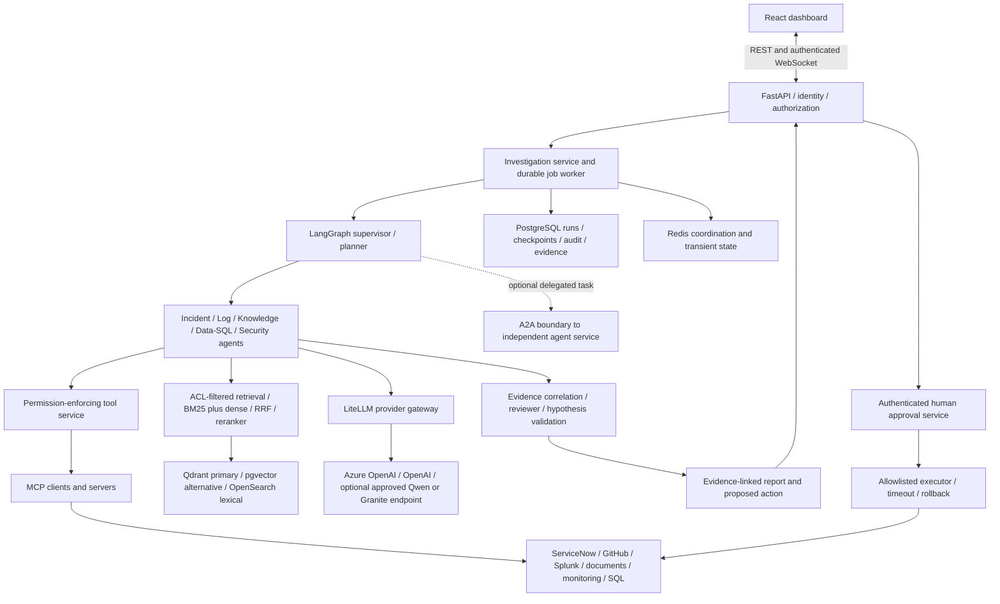
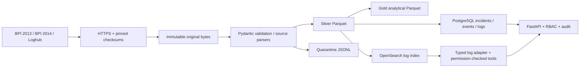

# Enterprise Agentic AI Operations

A data-first foundation for an enterprise incident investigation platform. It acquires public IT incident and infrastructure-log datasets, preserves their provenance, produces validated analytical data, and exposes authenticated incident and log-search APIs.

**Current scope: Milestone 1 data foundation plus Phase B interfaces.** No LLM agents, automated remediation, enterprise OAuth connectors, or RAG evaluation are implemented yet. The [technology plan](docs/technology-plan.md) assigns these to later milestones. This is a production-oriented portfolio foundation, not a production deployment certification.

## Target platform

The [governing enterprise/Azure architecture and Phase A–M plan](docs/target-architecture.md) maps the current implementation to LangGraph specialists, MCP, optional A2A, hybrid RAG, LiteLLM, human approval, React and AKS. It includes an evidence-based status audit and acceptance gates. These are target capabilities; the implemented baseline now includes the [Phase B contracts and permission-checked log tool](docs/phase-b.md).

## Target enterprise flowchart

The diagram below is the intended platform. **Implemented today:** data ingestion, incident APIs, OpenSearch log search, typed service contracts and a permission-checked read-only tool registry. Agents, MCP/A2A, hybrid RAG, model calls, approvals, React and Azure deployment remain planned. Human approval gates consequential execution.



Azure target: Azure OpenAI, Foundry, AKS, Blob Storage/ADLS, Key Vault, Entra ID, Azure Database for PostgreSQL, Azure Monitor and Application Insights. Azure ML is conditional on a training or managed model-lifecycle workload. No Azure resources are deployed by this repository yet.

## Delivery status — 2026-09-27

| Phase | Status |
| --- | --- |
| A: audit and foundation | Baseline audited; data/API/backend checks verified |
| B: domain/service/tool interfaces | Complete; typed contracts and permission-checked log-search path |
| C: durable async infrastructure | Next: PostgreSQL investigation runs/jobs and Redis coordination |
| D–F: enterprise adapters, retrieval, agents | Planned |
| G–I: MCP, conditional A2A, human approval | Planned |
| J–M: evaluation, telemetry, security hardening, deployment/dashboard | Planned; feature-level checks and safeguards start earlier |

Latest implementation verification: **64 local tests passed, 2 backend tests skipped locally**; real backend and container checks passed in [GitHub CI](https://github.com/sumanthreddy369/enterprise-agentic-ai-operations/actions/runs/36365649081). See [Phase B details](docs/phase-b.md) and the [full acceptance plan](docs/target-architecture.md).

## Documentation guide

- [Dataset catalog, schemas, provenance and reproduction](docs/datasets.md)
- [Machine-readable dataset manifest](data/dataset_manifest.json)
- [Phase A–M architecture and Azure mapping](docs/target-architecture.md)
- [Technology choices and original milestone history](docs/technology-plan.md)
- [Implemented tool boundary](docs/phase-b.md)
- [Guardrails and showcase](docs/guardrails.md), [security boundary](SECURITY.md)
- [Verification history](docs/verification.md), [ONNX/OpenVINO plan](docs/inference-optimization.md)
- [Contribution workflow](CONTRIBUTING.md) and [ignore rules](.gitignore)

## Implemented data flow



Source IDs are namespaced. Loghub datasets are **not** linked to BPI incidents. Similar identifiers or timestamps do not establish relationships. BPI 2013 events link only to their original trace IDs. No fabricated resolutions or root-cause labels are generated.

## Stack

Python 3.11+, Pydantic v2, FastAPI, asyncio/httpx, Pandas 2.x, Polars, PyArrow, SQLAlchemy 2.x, Alembic, PostgreSQL 16 and OpenSearch. Tenacity handles download transport retries; log indexing has bounded retries, item-level failure detection and a circuit breaker. JSON logging includes request IDs and durations.

SQLite is an explicitly limited local test/development backend. PostgreSQL is the deployment target. Redis and Qdrant are optional `future` Compose services with no M1 application integration.

## Local setup

Install Python 3.11+ and [uv](https://docs.astral.sh/uv/). Run commands from the repository root:

```sh
uv sync --frozen --python 3.11
uv run python scripts/init_local.py
uv run alembic upgrade head
uv run ops-data all --limit 100 --load
uv run uvicorn apps.api.main:app --host 127.0.0.1 --port 8000 --no-access-log --no-proxy-headers
```

`init_local.py` generates random credentials in ignored `.env` and refuses to overwrite an existing file. The API fails authentication when no valid key is configured. Visit [API docs](http://localhost:8000/docs), authorize with `API_READ_KEY` or `API_WRITE_KEY` from `.env`, and keep those values private. `/health` is liveness; `/ready` checks migrations, the incident table, and optionally OpenSearch. SQLite mode does not supply log search without OpenSearch.

### PostgreSQL and OpenSearch with Docker

Docker Desktop must have its Linux engine running, with enough memory for OpenSearch (4 GB or more allocated to Docker is a practical local starting point). On Linux, set `vm.max_map_count=262144` if required by OpenSearch.

```sh
docker compose up -d --build --wait
uv run python scripts/run_integration.py
```

The API runs at `http://localhost:8000`, PostgreSQL at `localhost:55432`, and OpenSearch at `http://localhost:19200`. Compose migrations run before the API. All published ports bind to loopback; OpenSearch security is disabled only for this local environment. Do not expose this Compose stack publicly.

To load data into Compose services, set `DATABASE_URL` in your shell to `postgresql+asyncpg://ops:<POSTGRES_PASSWORD>@localhost:55432/operations` using the generated password (never commit it), then:

```sh
uv run ops-data all --limit 100 --load --index
```

Use `docker compose down` to stop services; named volumes retain data. Qdrant/Redis can be started with the `future` profile, but they have no application integration yet.

## Public data and licensing

The [dataset guide](docs/datasets.md) explains each source, schema, usage and limitations. The [machine-readable manifest](data/dataset_manifest.json) records source URLs, measured checksums/sizes/counts, actual schemas, intended use, license links, provenance and limitations.

| Source | Verified default acquisition | Parser |
| --- | --- | --- |
| [BPI 2013, Volvo IT incidents](https://figshare.com/articles/dataset/BPI_Challenge_2013_incidents/12693914) | 7,554 traces / 65,533 events; 1,322,247 compressed bytes | gzip XES, complete-trace subsets |
| [BPI 2014, Rabobank incident details](https://figshare.com/articles/dataset/_/12692378) | 46,809 rows (203 lack incident IDs); 14,306,331 bytes | semicolon CSV |
| [Loghub Apache, OpenStack, BGL, HDFS, Zookeeper](https://github.com/logpai/loghub) | 2,000 raw lines each, pinned repository revision | dataset-specific raw-line parsers |

BPI releases use 4TU General Terms of Use. Loghub permits research/academic use with attribution and license notice; it is not assumed to have the Apache software license. Review the original terms before other uses. Raw data and generated outputs are ignored by Git; no Git LFS is needed. Data can contain names and identifiers, so keep it local and access-controlled. The [Loghub notice](docs/LOGHUB-LICENSE.txt) accompanies acquired Loghub samples.

Default processing uses the first 100 records per source, or 100 **complete** BPI 2013 traces. `--full` processes all records in the acquired file:

```sh
uv run ops-data all --full --load
uv run ops-data bpi-2014 --full --timezone Europe/Amsterdam
```

Timezone selection is an explicit assumption, not verified source metadata. Without it, timezone-naive timestamps remain null in normalized time fields while original strings are retained. Offset-bearing XES timestamps and BGL epoch seconds normalize to UTC. Ambiguous/nonexistent local times are rejected. The BPI 2013 opening time means first **observed** event, not guaranteed actual creation time. Generated incident titles are display labels, not invented descriptions.

Full Loghub archive links are in the manifest. Download and unpack an archive separately, review its license, record its SHA-256, and import the uncompressed file:

```sh
uv run ops-data loghub-hdfs --input /path/to/HDFS.log --sha256 <verified-sha256> --full --load --index
```

No archive is extracted automatically. A changed checksum requires deliberate manifest review; existing raw files are never silently overwritten. Full Loghub archive byte integrity has not been verified by the M1 sample acquisition.

## Pipeline behavior

- **Bronze:** original file bytes, partitioned by dataset and SHA-256.
- **Silver:** separate incident, event and log Parquet contracts. Source attributes are JSON strings inside Parquet and JSON objects in database/index records. Normalized times are UTC ISO-8601 strings in Parquet.
- **Gold:** incident history, observed event timelines, incident status counts, log severity counts and repeated-message frequencies. Repeated messages are a feature, not a claim of anomaly or root cause.
- Invalid records go to a run-specific quarantine file. Run reports include accepted, duplicate and quarantined counts. Original bytes remain available.
- Run identity includes input checksum, parser version, limit and timezone policy. Completed runs verify output checksums before reuse. Partial runs are rebuilt; corrupted Bronze fails closed.
- SQL loading commits batches, and stable source identities allow replay after partial failure. OpenSearch uses deterministic document IDs. There is no distributed transaction across the database and search index; replay repairs interrupted indexing.

The CLI is operator-only and assumes a trusted manifest. Do not expose arbitrary input paths/download URLs through a public endpoint. Very large files need capacity planning; M1 does not promise distributed ingestion or automatic schema drift recovery.

## API

| Endpoint | Access | Behavior |
| --- | --- | --- |
| `POST /api/v1/incidents` | writer | Validated create, required `Idempotency-Key`, atomic audit record |
| `GET /api/v1/incidents` | reader/writer | Bounded offset pagination and optional source filter |
| `GET /api/v1/incidents/{id}` | reader/writer | Retrieve a source-scoped incident |
| `GET /api/v1/logs?q=...&source=...` | reader/writer | Typed read-only tool search with authorized source filtering |
| `GET /health`, `GET /ready` | public | Liveness and dependency readiness |
| `GET /docs`, `GET /openapi.json` | public | Interactive API reference and schema |

Create body example (explicitly synthetic manual input):

```json
{"source_id":"manual-example-1","title":"Synthetic example incident","status":"open","opened_at":"2026-01-01T12:00:00Z"}
```

Send `Authorization: Bearer <API_WRITE_KEY>` and `Idempotency-Key: <unique-key>`. Reusing the same key/body returns the original record; different content returns 409. Client writes use the authenticated local-writer namespace and cannot impersonate benchmark sources. M1 keys identify local roles, not enterprise users; OIDC and named principals are planned before enterprise deployment.

Investigation, report, approval and rejection endpoints are deliberately deferred. Schema tables for these future features do not imply working agents or remediation.

## Verification

```sh
uv run ruff check .
uv run ruff format --check .
uv run mypy src apps
uv run pytest -q
uv run alembic check
```

Unit/API tests use synthetic fixtures in temporary directories and real Alembic migrations. Backend tests skip unless `TEST_DATABASE_URL` and `TEST_OPENSEARCH_URL` are provided; `scripts/run_integration.py` configures these for local Compose. CI runs static checks, unit tests, PostgreSQL/OpenSearch integration and a container API smoke test. See [verification results](docs/verification.md) for actual outcomes and blockers.

## Layout and design

`apps/api` contains the HTTP boundary; `src/models`, `ingestion`, `pipelines`, `integrations`, `services`, `security` and `observability` implement the foundation. `infrastructure` holds migrations, container definitions and [SQL analytics](infrastructure/analytics.sql). Future agent/dashboard directories are explicitly marked as planned. See [architecture decisions](docs/architecture.md) and the [technology/milestone plan](docs/technology-plan.md).

## Guardrails

The [guardrail matrix and showcase walkthrough](docs/guardrails.md) separates enforced controls from later release gates. M1 includes request/body/rate/concurrency limits, host and download allowlists, redacted validation errors, timeout handling, replay safety and fail-closed production promotion. Run the negative tests to demonstrate the controls. See [SECURITY.md](SECURITY.md) for the security boundary.

## Security and roadmap

No secrets or raw datasets are committed. Database constraints scope identifiers; API schemas reject unknown fields. The current service cannot execute corrective actions. Before deployment, add enterprise identity, tenant/ACL isolation, TLS, secrets management, audited key rotation, distributed rate limits, retention, monitoring, backups and restore tests. Local role keys and a security-disabled local search container are not production security controls.

**Next phase: C**, durable investigation runs/jobs and Redis coordination on the existing API/database foundation. Later phases add authorized connectors, incremental ETL, document ingestion and measured hybrid retrieval. Then implement evidence-grounded LangGraph agents, followed by mandatory approval-controlled remediation. Detailed choices for BGE, HNSW, RRF, MRR/nDCG, Langfuse, MSAL, Ray and Milvus are in the plan; none is claimed complete prematurely.
