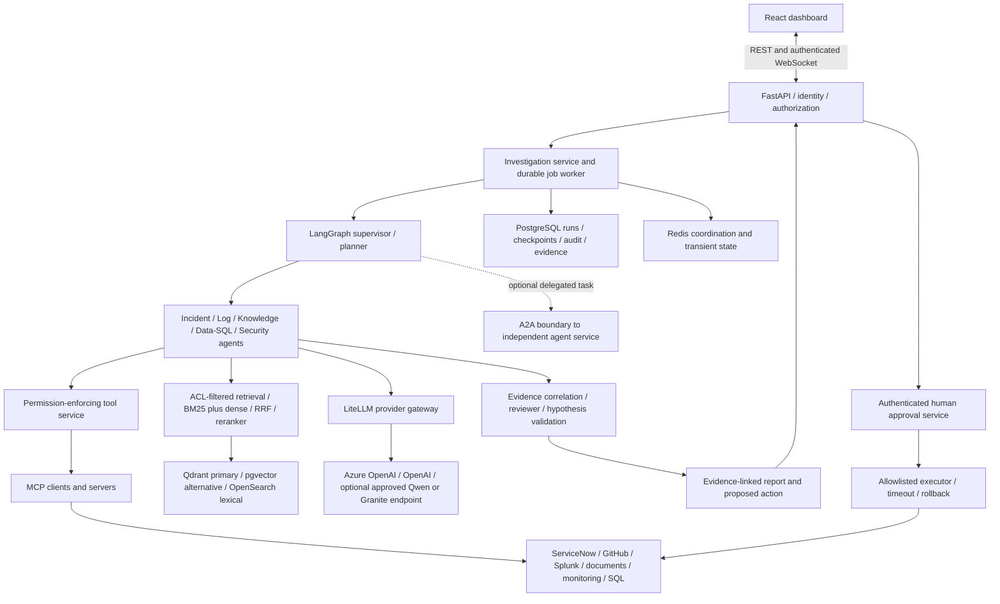

# Enterprise target architecture and Phase A–M delivery plan

Updated 2026-09-27. This is the governing target architecture requested by the project owner. It expands the original milestone roadmap; it does not relabel planned features as implemented. The original instruction to stop after Milestone 1 explains why the repository currently contains a tested data foundation rather than the full platform.

## Architecture audit: what exists now

| Area | Repository evidence | Actual status |
| --- | --- | --- |
| API and contracts | `apps/api/main.py`, `src/models/contracts.py` | Incident REST API, log search, health/readiness, Pydantic contracts implemented. No investigation streaming API yet. |
| Data foundation | `src/ingestion`, `src/pipelines`, dataset manifest | Reproducible public-data acquisition, Bronze/Silver/Gold, provenance, quarantine and replay implemented. |
| Database | SQLAlchemy models and Alembic migration | PostgreSQL schema and loading implemented; SQLite local mode. Investigation/approval tables are preparatory, not functioning workflows. |
| Search | `src/integrations/opensearch.py` | Text log search/indexing implemented; not a complete document hybrid RAG system. |
| Security | `src/security`, guardrail tests | Local bearer roles, input/resource controls, egress restrictions and fail-closed production gate. No Entra/OIDC, tenancy or document ACL enforcement yet. |
| Infrastructure | Dockerfile, Compose, GitHub Actions | Container build and real PostgreSQL/OpenSearch CI checks verified in the M1 report. Redis/Qdrant are optional service declarations only. |
| Observability | JSON logger and request/run identifiers | Structured logging implemented; no OpenTelemetry/Langfuse instrumentation yet. |
| Agents, RAG, MCP, dashboard | README placeholders in the corresponding directories | Not implemented. Placeholder directories are not features. |
| LiteLLM, A2A, pgvector, DeepEval, Azure deployment | No current implementation | Accepted in the target plan below; not installed/deployed by this documentation update. |
| ONNX Runtime / OpenVINO | Inference optimization plan | Optional planned embedding/reranker backends, not implemented. |

The prior verification report records 41 unit/API/security tests and 2 real-backend CI tests. This architecture audit inspects code, dependencies and infrastructure declarations; it does not constitute a fresh production-readiness or penetration test. The local Docker Desktop startup issue remains a known environment blocker.

## Corrected logical architecture

This is a target diagram, not a diagram of already-running components. Identity, authorization, evidence provenance and observability apply across all paths.

### Important boundary decisions

- **FastAPI is the application boundary.** The dashboard creates investigations, reads reports and submits approval decisions through it. Approval is not a prerequisite to calling the API; it is a prerequisite to consequential execution.
- **MCP is the tool protocol.** Phase D adapters work directly through typed tool interfaces first; Phase G exposes those same interfaces through MCP. Permission checks remain server-side at invocation. A protocol does not confer authorization.
- **A2A is optional interoperability.** Use it for an independently deployed/owned agent with task lifecycle, identity and versioned capabilities. Internal LangGraph worker calls and retrieval do not require A2A. Phase H can end with a documented deferral if no genuine remote-agent use case exists.
- **Retrieval and LLM access are services agents call.** Neither forms a mandatory one-way hop after every worker. Deterministic analysis avoids unnecessary model calls.
- **The Security agent is advisory.** It can identify risky content/actions and produce findings; deterministic authorization, tenant isolation and approval checks cannot be overruled by an LLM or reviewer score.
- **Five primary workers cover the new topology.** Preserve earlier change intelligence, historical incidents, evidence correlation, root-cause hypotheses and remediation planning as explicit worker skills/review stages; do not lose those capabilities during regrouping.
- **Durable state is separate from memory.** PostgreSQL persists runs/checkpoints/approval history. Redis supports coordination/cache with explicit expiry and recovery. Any longer-lived agent memory must be source- and tenant-scoped, versioned and deletable; never treat untrusted memory as policy.
- **Provider fallback is a policy decision.** LiteLLM normalizes approved model access; it does not make models semantically interchangeable. No silent Azure-to-public/local fallback across data-residency or confidentiality boundaries. Validate structured output/tool-call behavior per provider and record actual usage/cost.

## Phase order and acceptance gates

Security, tests and basic telemetry start with each feature. Phases J–L expand them; they are not permission to delay safeguards until the end.

| Phase | Deliverable | Acceptance gate / current status |
| --- | --- | --- |
| A — Audit/stabilize | Inventory, current tests/CI, schema and dependency review, known-issue log | Architecture inventory done in this document. Recheck CI and resolve behavioral blockers before expanding runtime features. |
| B — Interfaces | Domain contracts, investigation service, tool registry, authorization context, connector/retriever/model interfaces | Delivered typed domain/service ports, read-only registry and API-integrated log adapter; see [Phase B](phase-b.md). Investigation execution remains Phase C/F work. |
| C — Async infrastructure | Extend FastAPI/PostgreSQL; durable runs/jobs; Redis coordination; pooling/timeouts/cancellation | Restart/replay/concurrency tests; Redis loss cannot erase the authoritative run or approval record. Existing API/database foundations are reused. **Next implementation step.** |
| D — Enterprise adapters | ServiceNow-like incidents/history/changes, Splunk logs, GitHub, SharePoint/Drive knowledge, SQL and monitoring | Mock and real implementations share interfaces; credential scopes, pagination, retry limits, provenance and read-only defaults tested. Credentials needed only for real-system tests. Write tools stay unavailable until I. |
| E — RAG/evidence | BGE embeddings, BM25/dense hybrid search, RRF, reranking, metadata/ACL filters, bounded query rewriting, citations | Qdrant primary and pgvector alternative pass the same retrieval contract. Versioned evidence and human-judged nDCG/MRR/Recall evaluations; no unauthorized documents in results. Optional ONNX/OpenVINO benchmarks follow the existing plan. |
| F — Supervisor/agents | LangGraph planner, five workers, reviewer, persistent checkpointing, bounded scoped memory and pause/resume | Evidence-linked hypotheses, budget/step/time limits, deterministic tool authorization, restart/resume and trajectory tests. Wire the LiteLLM gateway before model-backed workers; retain deterministic local test mode. |
| G — MCP | Tool servers/clients over selected authenticated transport | Same tool policy, schemas, tenant context and audit behavior as direct adapters; malicious result/injection, cancellation and reconnect tests. |
| H — A2A where justified | One independently deployed agent interoperability adapter or explicit deferral | Capability/version discovery, authenticated tasks, cancellation, artifact provenance and failure propagation; no protocol added just for a diagram. |
| I — Human approval | Proposal/review/approve/reject APIs and allowlisted executor | Action digest/version binding, named approver, separation of duties, expiry, replay protection, timeouts, rollback and kill switch. No consequential write path bypasses the gate. |
| J — Evaluation | DeepEval harness, golden cases, retrieval/tool/answer/trajectory regression tests, latency and cost reports | Deterministic tests plus calibrated LLM-as-judge where useful; version judge/prompts and human review. Judges never decide authorization. Paid evaluation jobs are explicit, not required for ordinary unit tests. |
| K — Observability | OpenTelemetry plus Langfuse, correlated agent/tool/LLM/retrieval spans, usage/cost | Redaction, tenant access, sampling, retention and exporter-failure tests; external telemetry optional locally. Preserve trace context through jobs/MCP/A2A. |
| L — Security hardening | Entra/OIDC, RBAC/tool permissions, secrets, PII controls, injection defenses, audit integrity, tenant/ACL isolation | Negative authorization, data-leakage, injection, replay and identity tests; threat review. Existing production gate remains until these controls and deployment checks pass. |
| M — Deployment/product completion | Docker/Compose, GitHub Actions, Kubernetes/AKS manifests, infrastructure configuration and React dashboard | Private networking/secrets, probes/resources, migrations, rollout/rollback, backup/restore and end-to-end investigation-to-approval demo. Manifests alone are not an Azure deployment. |

The React dashboard should grow alongside the APIs from C onward, with the complete user journey gated in M: incident list, investigation progress, evidence and citations, hypotheses, approval/rejection, execution state, audit history and operational health. WebSocket subscriptions must authenticate, authorize each run, bound messages and handle reconnect without leaking another user's events.

## Azure deployment target

Azure is the primary cloud target; Compose remains the reproducible local environment. No Azure resources have been provisioned by this plan.

| Azure component | Intended responsibility | Required versus conditional |
| --- | --- | --- |
| Azure OpenAI | Primary approved hosted LLM deployment through LiteLLM | Required for the Azure reference deployment; actual model/deployment/region/quota selected during setup. |
| Azure AI Foundry / Microsoft Foundry | Model/project management and applicable evaluation capabilities | Use around the chosen model lifecycle; do not introduce a second competing supervisor when LangGraph owns orchestration. |
| AKS | API, workers, protocol services and optional local model serving | Target production runtime. Compose remains sufficient for local portfolio demonstrations. |
| Azure Database for PostgreSQL | Operational data, checkpoint and approval persistence; optional pgvector | Managed target for current PostgreSQL semantics; verify extension/version availability before enabling pgvector. |
| Redis-compatible managed service | Coordination, bounded caches and worker support | Select a supported Azure offering at deployment time; never store sole durable approval truth here. |
| Blob Storage / ADLS Gen2 | Raw/Bronze/Silver/Gold objects, approved documents and versioned model/evaluation artifacts | Preserve provenance, retention/access policies and checksums; ADLS hierarchical organization when needed. |
| Key Vault | Enterprise/API secrets and certificates | Required when secrets are unavoidable. Prefer workload identities for supported Azure services. |
| Entra ID | User OIDC, application roles, workload identities | Required for enterprise identity; validate issuer/audience/expiry and enforce app permissions independently of model output. |
| Azure Monitor + Application Insights | Platform monitoring and application tracing/alerts | Integrate through OpenTelemetry with consistent trace IDs; Langfuse supplies the complementary model/agent view. |
| Azure Container Registry | Versioned application images | Required for the reference delivery pipeline; scan and pin deployments. |
| Azure ML | Managed training/fine-tuning, experiment/benchmark jobs or custom model lifecycle needs | Conditional. Not required merely to call Azure OpenAI or run LangGraph. Introduce only for a concrete workload. |

Use Entra Workload Identity for AKS-to-Azure access where supported, private endpoints/network policy, TLS, least-privilege identities and GitHub-to-Azure federated deployment credentials. Keep regional availability, quota, data residency, telemetry destinations and cost decisions explicit. OpenAI and optional Qwen/Granite remain alternative approved providers, not automatic failover destinations.

Qdrant and OpenSearch need their own approved managed or operated deployment choices; do not imply Azure hosts them natively just because the application runs on AKS. pgvector is an alternative vector adapter, not a requirement to mirror every vector in two stores.

## Delivery rules

- Commit and push each completed, verified implementation step to GitHub, as requested. Report what changed, which checks ran and any blockers.
- Keep statuses honest: source code plus tests establish implementation; provider credentials and live results establish integration; actual deployed resources establish deployment.
- Preserve the existing data foundation. Do not replace working modules with skeletons or claim placeholder interfaces are live integrations.
- No Azure provisioning, paid model calls, model downloads or new runtime integrations occur in this architecture-only update.

## Primary references

- [MCP and A2A responsibilities](https://a2a-protocol.org/latest/topics/a2a-and-mcp/)
- [LiteLLM provider abstraction](https://docs.litellm.ai/docs/)
- [AKS baseline architecture](https://learn.microsoft.com/en-us/azure/architecture/reference-architectures/containers/aks/baseline-aks)
- [AKS Entra Workload Identity](https://learn.microsoft.com/en-us/azure/aks/workload-identity-overview)
- [Azure AI/ML platform selection](https://learn.microsoft.com/en-us/azure/architecture/ai-ml/guide/data-science-and-machine-learning)
- [OpenAI production guidance](https://developers.openai.com/api/docs/guides/production-best-practices)
